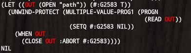

# VIVID-DIFF 2.0.0
## What is this?
Colored object diff viewer.

Intended to be used in the test frameworks.

## Alternatives and differences.

| name                  | target      | output     | patch |
| --------------------- | ----------- | ---------- | ----- |
| [cl-difflib]          | sequence    | unix-style | *     |
| [clos-diff]           | clos-object | list       | *     |
| [monkylib-prose-diff] | text-file   | html       |       |
| [diff]                | text-file   | unix-style |       |
| [diff-match-patch]    | sequence    | list       | *     |
| vivid-diff            | any object  | colored    |       |

[cl-difflib]: https://github.com/wiseman/cl-difflib
[clos-diff]: https://github.com/krzysz00/clos-diff
[monkeylib-prose-diff]: https://github.com/gigamonkey/monkeylib-prose-diff
[diff]: https://github.com/sharplispers/diff
[diff-match-patch]: https://github.com/agrostis/diff-match-patch

## Usage

```lisp
(let ((expected '(:a :b :c))
      (actual '(:a "b" :c)))
  (diff-print (mismatch-sexp actual expected)))
```


```lisp
(let ((expected "Common Lisp is awesome!!")
      (actual   "Common lisp is awesome!!"))
  (diff-print (mismatch-sexp actual expected)))
```


```lisp
(let ((expected (alexandria:plist-hash-table '(:a "a" :b "b" :c "c")))
      (actual (alexandria:plist-hash-table '(:b :b :c "c" :d "d"))))
  (diff-print (mismatch-sexp actual expected)))
```


As the name shows, `MISMATCH-SEXP` is for S-Expression, i.e. macroexpanded form.
Please note about uninterned symbols are treated as the same as expected.
(In corner cases, this behavior may be the pitfall though.)

```lisp
(let ((expected (macroexpand-1 '(with-open-file (s "path") (read s))))
      (actual (macroexpand-1 '(with-open-file (out "path") (read out)))))
  (diff-print (mismatch-sexp actual expected)))
```


## From developer

### Product's goal

### License
MIT

### Developed with
SBCL

### Tested with
* SBCL/2.1.7
* CCL/1.12.1
* ECL/21.2.1
* CLISP/2.49
* Allegro/10.1
* CMUCL/21D ; See below.
* ABCL/1.8.0

### Known issue
#### CMUCL
CMUCL pass the test of `vivid-diff` but `vivid-colors` that `vivid-diff` depends on does not support CMUCL.

## Installation

