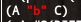
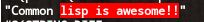
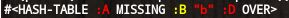

# VIVID-DIFF 1.0.0
## What is this?
Colored object diff viewer.

Intended to be used in the test frameworks.

## Alternatives and differences.

| ------ | [cl-difflib] | [clos-diff] | [monkylib-prose-diff] | [diff]     | [diff-match-patch] | vivid-diff      |
| ------ | ------------ | ----------- | --------------------- | ---------- | ------------------ | --------------- |
| target | sequence     | clos-object | text-file             | text-file  | sequence           | any lisp object |
| output | unix-style   | list        | html                  | unix-style | list		| colored         |
| patch  | *            | *           |                       |            | *                  |                 |

[cl-difflib]: https://github.com/wiseman/cl-difflib
[clos-diff]: https://github.com/krzysz00/clos-diff
[monlylib-prose-diff]: https://github.com/gigamonkey/monkeylib-prose-diff
[diff]: https://github.com/sharplispers/diff
[diff-match-patch]: https://github.com/agrostis/diff-match-patch

## Usage

```lisp
(let ((expected '(:a :b :c))
      (actual '(:a "b" :c)))
  (princ (mismatch-sexp actual expected)))
```


```lisp
(let ((expected "Common Lisp is awesome!!")
      (actual   "Common lisp is awesome!!"))
  (princ (mismatch-sexp actual expected)))
```


```lisp
(let ((expected (alexandria:plist-hash-table '(:a "a" :b "b" :c "c")))
      (actual (alexandria:plist-hash-table '(:b :b :c "c" :d "d"))))
  (princ (mismatch-sexp actual expected)))
```


## From developer

### Product's goal

### License
MIT

### Developed with
SBCL

### Tested with

## Installation

